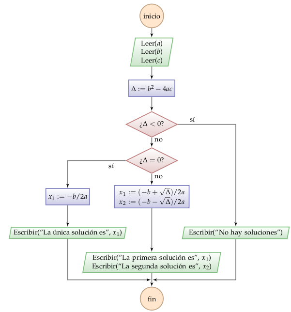

Materia
=======

Algoritmos
----------

.. index:: algoritmo, ejecución, entrada, proceso, salida

Un **algoritmo** es una secuencia de pasos para resolver un problema.

Todo algoritmo tiene un inicio y un final.
Los pasos deben estar muy bien definidos,
y tienen que describir sin ambigüedades
cómo llegar desde el inicio hasta el final.

El seguir los pasos de un algoritmo se denomina **ejecutar** el algoritmo.

Las partes de un algoritmo tiene tres componentes que siempre están presentes:

1. la **entrada**: son los datos que necesita un algoritmo
   para poder ser ejecutado;
2. el **proceso**: son los pasos que hay que seguir,
   utilizando la entrada;
3. la **salida**: es el resultado que entrega el algoritmo.

Todo el mundo conoce y utiliza algoritmos a diario,
incluso sin darse cuenta:

* Una receta de cocina es un algoritmo;
  si bien podríamos cuestionar que algunos pasos son ambiguos
  (¿cuánto es «una pizca de sal»? ¿qué significa «agregar a gusto»?),
  en general las instrucciones están lo suficientemente bien definidas
  para que uno las pueda seguir sin problemas.

  La entrada de una receta son los ingredientes
  y algunos datos como: ¿para cuántas personas se cocinará?
  El proceso es la serie de pasos para manipular los ingredientes.
  La salida es el plato terminado.

* El método para multiplicar números a mano
  que se aprende en el colegio es un algoritmo.
  Dado cualquier par de números enteros,
  si seguimos paso a paso el procedimiento
  siempre obtendremos el producto.

  La entrada del algoritmo de multiplicación
  son los dos factores.
  El proceso es la secuencia de pasos
  en que los dígitos van siendo multiplicados
  las reservas van siendo sumadas,
  y los productos intermedios son finalmente sumados.
  La salida del algoritmo es el producto obtenido.

No toda secuencia de instrucciones es un algoritmo.
Un algoritmo debe poder seguirse
sin necesidad de usar inteligencia, intuición ni habilidad.
Un criterio para saber si un algoritmo está bien descrito
puede ser: ¿podría un robot seguir estas instrucciones sin equivocarse?

Un ejemplo sencillo: resolver una ecuación cuadrática
-----------------------------------------------------
Una `ecuación cuadrática`_
es una ecuación de la forma
:math:`ax^2 + bx + c = 0`,
donde :math:`a`, :math:`b` y :math:`c` son datos dados
y :math:`x` es la incógnita que se desea determinar.

.. _ecuación cuadrática: http://es.wikipedia.org/wiki/Ecuaci%C3%B3n_de_segundo_grado

Por ejemplo, :math:`2x^2 - 5x + 2 = 0` es una ecuación cuadrática
con :math:`a = 2`, :math:`b = -5` y :math:`c = 2`.
Sus soluciones son :math:`x_1 = 1/2` y :math:`x_2 = 2`,
como se puede comprobar reemplazando estos valores en la ecuación.

En álgebra aprendemos un algoritmo para resolver estas ecuaciones.
Es lo suficientemente detallado para que pueda usarlo cualquier persona,
incluso sin saber qué es una ecuación cuadrática.

1. Obtener los valores de
   :math:`a`, :math:`b` y :math:`c`.
2. Calcular el discriminante :math:`b^2 - 4ac`, y llamarlo :math:`Δ`.
3. Si :math:`Δ < 0`, entonces la ecuación no tiene soluciones reales.
4. Si :math:`Δ = 0`, entonces la ecuación tiene una solución real,
   que es :math:`x = -b/2a`.
5. Si :math:`Δ > 0`, entonces
   la ecuación tiene dos soluciones reales,
   que son :math:`x = (-b ± \sqrt{Δ})/2a`.
6. Entregar las soluciones :math:`x` obtenidas.

La entrada es el paso 1, la salida es el paso 6,
y el resto de los pasos son parte del proceso.

Elementos de un algoritmo
-------------------------

**Expresiones**
  Una **expresión** es una combinación de valores y operaciones
  que son evaluados durante la ejecución del algoritmo
  para obtener un valor.
  Por ejemplo, :math:`2 + 3` es una expresión
  que, al ser evaluada, siempre entrega el valor :math:`5`.

  En el ejemplo, :math:`b^2 - 4ac` es una expresión,
  cuyo valor depende de qué valores tienen
  :math:`a`, :math:`b` y :math:`c`
  al momento de la evaluación.

  Las diferentes partes de una expresión
  también son expresiones por sí solas.
  En el ejemplo, :math:`b^2`, :math:`b` y :math:`4ac`
  son expresiones.

**Asignaciones**
  Cuando un algoritmo calcula valores,
  se necesita ponerles un nombre para poder referirse a ellos
  en pasos posteriores.
  Es lo que hacemos en el paso 2 de nuestro algoritmo,
  cuando calculamos el discriminante y lo llamamos :math:`Δ`.
  Esto se llama una **asignación**,
  y se representa así: ``nombre := expresión``.
  Al nombre utilizado se le dice **variable**.

  La asignación del ejemplo sería::

    Δ := b² − 4ac;

**Condicionales**
  A veces un algoritmo debe realizar pasos diferentes
  bajo condiciones distintas.
  Es lo que hacemos en el paso 3 del ejemplo:
  decidimos que la ecuación no tiene soluciones
  solamente cuando se cumple que :math:`Δ < 0`.
  Esto se llama un **condicional**.

  La condición que determina qué ejecutar
  es una expresión, cuyo valor debe ser
  verdadero o falso.

**Ciclos**
  Un **ciclo** ocurre cuando
  un algoritmo ejecuta los mismos pasos varias veces.
  El ejemplo no tiene ciclos.

**Entrada**
  Cuando un algoritmo necesita recibir un dato,
  se representa así: ``Leer(variable)``.
  Durante la ejecución, significa que el dato
  queda guardado en la variable.

  En el ejemplo, la entrada ocurre en el paso 1,
  y puede ser representada así::

    Leer(a);
    Leer(b);
    Leer(c);

**Salida**
  Una vez que el algoritmo ha resuelto el problema
  para el que fue diseñado,
  debe entregar sus resultados como un mensaje.
  La salida se representa así:
  ``Escribir(mensaje)``.

  En el ejemplo, cuando no existen soluciones,
  la salida puede ser representada así::

    Escribir('No hay soluciones');

  Cuando existe una única solución,
  se puede incluirla en el mensaje::

    Escribir('La solución única es', x);

Cómo describir un algoritmo
---------------------------
El lenguaje natural (la manera en que hablamos a diario)
no es el más apropiado para describir un algoritmo:
es complejo, ambiguo e impreciso.

Un algoritmo debe ser descrito en un lenguaje simbólico universal.
Dos lenguajes que usaremos son
los diagramas de flujo y el pseudocódigo.

Diagramas de flujo
~~~~~~~~~~~~~~~~~~
Un **diagrama de flujo** es una representación gráfica de un algoritmo.
Los pasos son representados por varios tipos de bloques,
y el flujo de ejecución es representado por flechas que conectan los bloques.

Nuestro algoritmo de ejemplo
puede ser representado así:

* El inicio y el final del algoritmo son representados con bloques circulares.
  El algoritmo siempre debe ser capaz llegar desde uno hasta el otro,
  sin importar por qué camino lo hace.
  Un algoritmo no puede «quedarse pegado» en la mitad.

* La entrada y la salida de datos son representadas con romboides,
  que en la figura de arriba están pintados de verde.

* Los condicionales son representadas con diamantes.
  Tiene que haber un camino saliente para cada caso posible.
  La condición se pone dentro del diamante.

* Los ciclos simplemente son flechas que regresan a bloques anteriores.

* Otras instrucciones (como las asignaciones)
  van dentro de rectángulos,
  que en la figura están pintados de azul.

Pseudocódigo
~~~~~~~~~~~~
El **pseudocódigo** es una representación
en que los pasos del algoritmo son descritos de manera estructurada
usando ciertas convenciones.
Es una mezcla de lenguaje natural con lenguaje de programación.

Nuestro ejemplo quedaría representado así::

    algoritmo EcuaciónSegundoGrado;
    inicio
        Leer(a);
        Leer(b);
        Leer(c);

        Δ := b² − 4ac;

        si Δ < 0 entonces
            Escribir('No hay soluciones reales');

        si Δ = 0 entonces
        inicio
            x₁ := −b / (2a);
            Escribir('La única solucion es ', x₁);
        fin

        si Δ > 0 entonces
        inicio
            x₁ := (−b + Raíz(Δ)) / (2a);
            x₂ := (−b − Raíz(Δ)) / (2a);
            Escribir('La primera solucion es ', x₁);
            Escribir('La segunda solucion es ', x₂);
        fin
    fin.

En el pseudocódigo de ejemplo podemos notar algunas de las convenciones.

* Cada instrucción es escrita en una línea,
  y terminada con un punto y coma.

* El algoritmo se lee de arriba a abajo,
  en el orden en que están escritas las instrucciones.

* Los condicionales se escriben con el formato
  ``si condición entonces instrucciones``.

* Si dentro de un condicional se ejecuta más de una instrucción,
  se marca explícitamente el inicio y el fin de las instrucciones.

* Las instrucciones dentro de un condicional
  son antecedidas con espacio en blanco.
  Esto se llama **indentación**,
  y es crucial para hacer el pseudocódigo más fácil de entender.

* Los mensajes son escritos entre comillas simples: ``'mensaje'``.

La ventaja del pseudocódigo es que es lo más parecido
al código que uno realmente escribe para desarrollar un programa
en el computador, y que aprenderemos más adelante.

