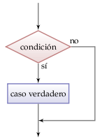
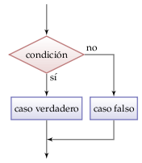
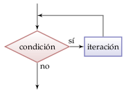
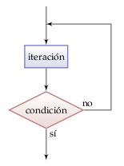
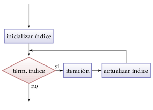

Sentencias de control en Pascal
===============================
.. index:: sentencia de control

Además de las sentencias simples,
que son ejecutadas en secuencia,
existen **sentencias de control**
que permiten modificar el flujo del programa
introduciendo ciclos y condicionales.

Una secuencia de control
incluye otra sentencia dentro de sí.
Por ejemplo, una sentencia condicional
incluye la sentencia que puede o no ejecutarse
dependiendo de una condición.

.. index:: begin-end

Para poner más de una sentencia
dentro de una sentencia de control,
es necesario encerrarlas
entre los delimitadores ``begin`` y ``end``.

.. index:: indentación

Al escribir las sentencias que van dentro de una sentencia de control,
se acostumbra a comenzar el renglón varias columnas más adelante.
Esto se llama **indentación**,
y es crucial para entender programas complejos.
Para indentar, lo típico es usar cuatro espacios.
Todos los ejemplos en esta sección están debidamente indentados.

Condicional if-then
-------------------
.. index:: if-then

La sentencia **if-then**
(en español: «si-entonces»)
ejecuta instrucciones
sólo si se cumple una condición.
Si la condición es falsa,
no se hace nada.

La sintaxis es la siguiente::

    if {condición} then
        {sentencia en el caso verdadero};

Por ejemplo,
el siguente código felicita a alguien
que aprobó la asignatura::

    Read(nota);
    if nota >= 55 then
        WriteLn('Felicitaciones');

Condicional if-then-else
------------------------
.. index:: if-then-else

La sentencia **if-then-else**
(«si-entonces-o-si-no»)
decide qué instrucciones ejecutar
dependiendo si una condición es verdadera o falsa.
La sintaxis es la siguiente::

    if {condición} then
        {sentencia en el caso verdadero};
    else
        {sentencia en el caso falso};

Por ejemplo,
el siguiente código permite obtener
`cuántos días tiene`_ un año dado::

    Read(year);
    if (year mod 4 = 0) and ((year mod 100 <> 0) or
                             (year mod 400 = 0)) then
        WriteLn(year, ' tiene ', 366, ' dias')
    else
        WriteLn(year, ' tiene ', 365, ' dias');

.. _cuántos días tiene: http://es.wikipedia.org/wiki/Año_bisiesto

Ciclo while
-----------
.. index:: while

El ciclo **while**
(«mientras»)
ejecuta una secuencia de instrucciones
mientras una condición sea verdadera.

La condición es evaluada antes de cada iteración.
Si la condición es inicialmente falsa,
el ciclo no se ejecutará ninguna vez.

La sintaxis es la siguiente::

    while {condición} do
        {sentencia};

Por ejemplo,
el siguiente código
muestra por pantalla
la `secuencia de Collatz`_
del número ingresado por el usuario::

    Read(n);
    while n > 0 do
    begin
        WriteLn(n);
        if n mod 2 = 0 then
            n := n div 2;
        else
            n := 3 * n + 1;
    end;

.. _secuencia de Collatz: http://es.wikipedia.org/wiki/Conjetura_de_Collatz

En este ejemplo,
hay más de una sentencia en el cuerpo del ``while``,
por lo que se utiliza ``begin`` y ``end``
para delimitarlas.

Ciclo repeat-until
------------------
.. index:: repeat-until

El ciclo **repeat-until**
(«repetir-hasta»)
ejecuta una secuencia de instrucciones
hasta que se cumpla la condición de término.

La condición es evaluada después de cada iteración,
por lo que el ciclo siempre es ejecutado
por lo menos una vez.

La sintaxis es la siguiente::

    repeat
        {sentencia};
    until {condición};

A diferencia de las demás sentencias,
no es necesario usar ``begin`` y ``end``
al poner más de una instrucción dentro del ``repeat``.

Ciclo for
---------
El ciclo **for**
(«para»)
ejecuta una secuencia de instrucciones
un número predeterminado de veces.
Un ciclo *for* utiliza una **variable de control**
que toma diferentes valores en cada iteración.

.. index:: for, variable de control

La sintaxis es la siguiente::

    for {variable} := {valor inicial} to {valor final} do
        {sentencia};

Por ejemplo,
el siguiente código suma los números del uno al diez::

    suma := 0;
    for i := 1 to 10 do
        suma := suma + i;

En el ejemplo, el ciclo se ejecuta diez veces.
Después de cada iteración,
el valor de ``i`` es incrementado en 1.

Si el valor final es menor al valor inicial,
el ciclo nunca es ejecutado.

.. index:: downto

Para hacer que la variable de control tome valores de mayor a menor,
hay que reemplazar ``to`` por ``downto``.
Por ejemplo,
el siguiente código imprime una cuenta regresiva::

    for s := 20 downto 1 do
        WriteLn(s);
    WriteLn('¡Feliz año nuevo!');

Comentarios
-----------
.. include:: disqus.rst

