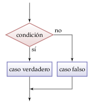

Sentencias en Pascal
====================

Condicional if-then
-------------------

La sentencia *if-then* ejecuta instrucciones
sólo si se cumple una condición.
La sintaxis es la siguiente::

    if condicion then
        instrucción;

Condicional if-then-else
------------------------

Condicional if-then-elseif-else
-------------------------------

Ciclo while
-----------

Ciclo repeat-until
------------------

Ciclo for
---------

