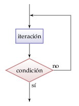
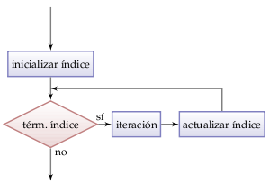

Sentencias en Pascal
====================

Condicional if-then
-------------------
.. image:: _static/imagenes/if.png
   :alt: (Diagrama de flujo if-then)
   :align: right

La sentencia **if-then** ejecuta instrucciones
sólo si se cumple una condición.
Si la condición es falsa,
no se hace nada.
La sintaxis es la siguiente::

    if condicion then
        instrucción en el caso verdadero;

Por ejemplo,
el siguente código felicita a alguien
que aprobó la asignatura::

    Read(nota);
    if nota >= 55 then
        WriteLn('Felicitaciones');

Condicional if-then-else
------------------------
.. image:: _static/imagenes/if-else.png
   :alt: (Diagrama de flujo if-then-else)
   :align: right

La sentencia **if-then-else**
decide qué instrucciones ejecutar
dependiendo si una condición es verdadera o falsa.
La sintaxis es la siguiente::

    if condicion then
        instrucción en el caso verdadero
    else
        instrucción en el caso falso;

Por ejemplo,
el siguiente código entrega
`cuántos días tiene un año`::

    Read(year);
    if (year mod 4 = 0) and ((year mod 100 <> 0) or
                             (year mod 400 = 0)) then
        WriteLn(year, ' tiene ', 366, ' dias')
    else
        WriteLn(year, ' tiene ', 365, ' dias');

.. _cuántos días tiene un año: http://es.wikipedia.org/wiki/Año_bisiesto

Condicional if-then-else-if-else
--------------------------------
.. image:: _static/imagenes/if-elseif-else.png
   :alt: (Diagrama de flujo if-then-elseif-else)
   :align: right

Para cubrir varios casos excluyentes,
se puede utilizar varias sentencias *if* anidadas,
en las que cada *if* va dentro de la parte *else*
del condicional anterior.

Ciclo while
-----------
.. image:: _static/imagenes/while.png
   :alt: (Diagrama de flujo while-do)
   :align: right

El ciclo **while** ejecuta instrucciones
mientras una condición sea verdadera.

La condición es evaluada antes de cada iteración.
Si la condición es inicialmente falsa,
el ciclo no se ejecutará ninguna vez.

La sintaxis es la siguiente::

    while condición do
        instrucción;

Ciclo repeat-until
------------------

El ciclo **repeat-until** ejecuta instrucciones
hasta que se cumpla la condición de término.

La condición es evaluada después de cada iteración,
por lo que el ciclo siempre es ejecutado
por lo menos una vez.

La sintaxis es la siguiente::

    repeat
        instrucciones;
    until condición;

A diferencia de las demás sentencias,
no es necesario usar ``begin`` y ``end``
al poner más de una instrucción dentro del ``repeat``.

Ciclo for
---------

.. El ciclo **for**

